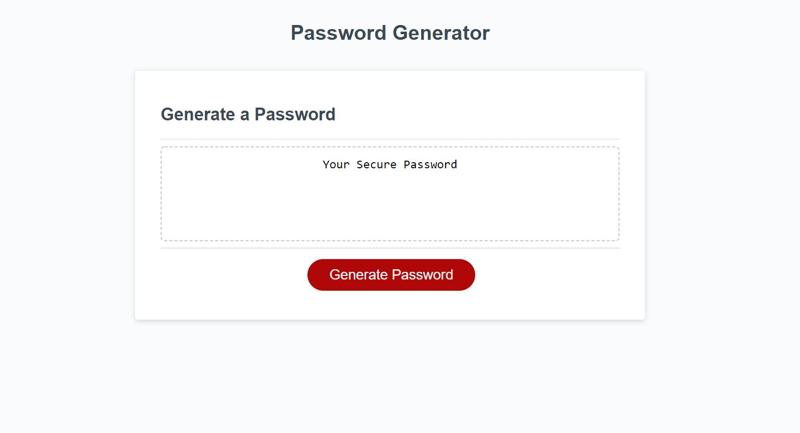
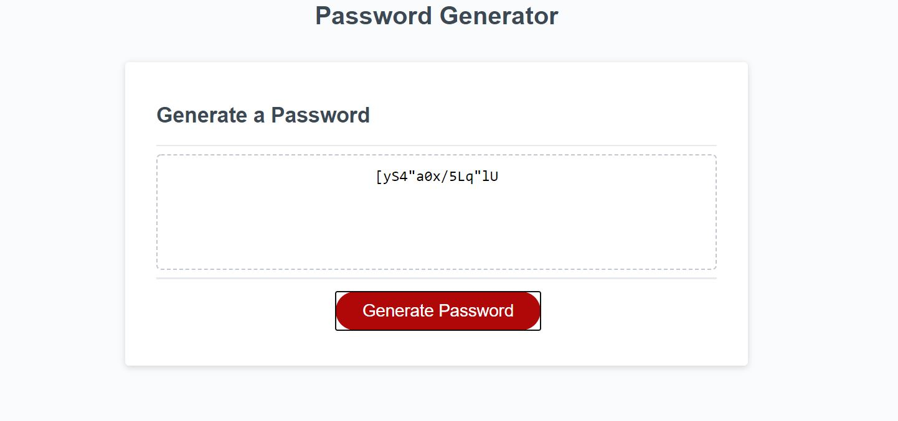

# Project Name: HomeWork3 Password Generator

### Description: Provide the user a password generator that will create a randomized password of their choosing. The password can be 8-128 characters long. The following charcter types can be created: lowercase letters, uppercase letters, numbers and special characters (!@#$...etc).

* getRandomChar function
  * Pulls random character from an array or string
  
* generatePassword function

  * Prompt the customer for password criteria
    * length between 8-124 characters
    * character types: lowercase, uppercase, numeric, and/or special characters
    * atleast one character type should be selected, else prompt again
   
  * Create a  password based on user criteria
    * Build password with for-loops and array
    * Convert array to string value for return output
 
    

## Visual:

[Gitpages Link](https://jordanks93.github.io/HomeWork3PasswordGenerator/)

## Author: 
Jordan Stuckman
